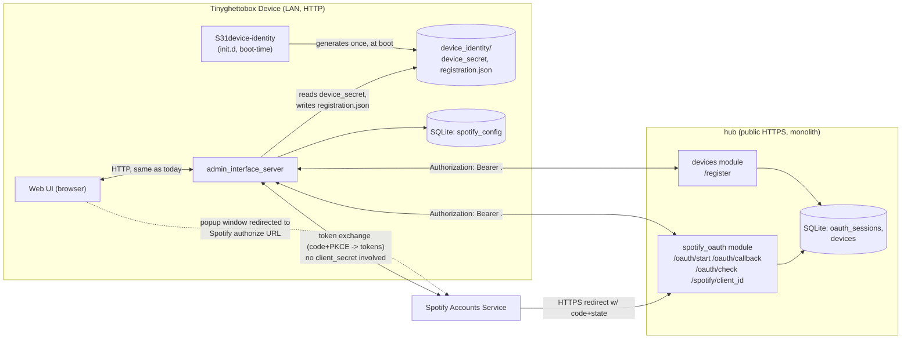
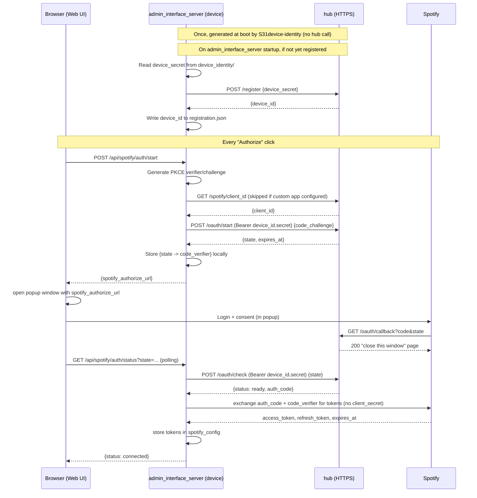

# Solution Design: `hub` — Device Identity & Spotify OAuth Relay

> Naming note: the service described here is called **`hub`** (not "broker" or "IAM service") — see decision #11. The folder this file lives in is still physically named `remote-server` pending a manual rename (see the note at the end of this document); treat every reference to `remote-server` below as the same thing as `hub`.

## 1. Problem Statement

Spotify now requires an HTTPS redirect URI for OAuth authorization. The device (`admin_interface_server`, running locally on the tinyghettobox hardware) only serves plain HTTP on the local network. Requiring every device owner to install and maintain a TLS certificate on their own hardware is impractical for a home/hobbyist project. Separately, today's design also requires every device owner to register their own Spotify Developer app just to get a `client_id`/`client_secret` — unnecessary friction for a consumer-facing feature.

**Decision:** Introduce `hub`, a centrally hosted HTTPS service that starts out doing two things — (a) relaying the Spotify OAuth `code`/`state` hop so devices never need their own TLS certs, and (b) owning a single shared Spotify `client_id` so most users never need to create their own Spotify Developer app. `hub` is designed **monolithically, but with clear internal module boundaries**, because it's explicitly intended to grow into the device fleet's general identity/account hub (device registration, later user accounts + device linking, later still a media "shop" — see [Section 11](#11-future-modules-deferred)). The device keeps doing the actual OAuth code→token exchange itself (see decision #1); `hub` never sees Spotify tokens.

## 2. Scope & Non-Goals

**In scope**
- `hub`: a new centrally hosted service, used by all devices, covering device registration + Spotify OAuth relay + shared `client_id` hosting.
- Changes to `admin_interface_server` (device side) to drive the new flow, plus a "Custom Spotify Developer App" opt-out for users who want to bring their own `client_id`/`client_secret`.
- Device identity (a boot-generated bearer credential) to authenticate device↔`hub` calls.

**Out of scope / explicitly deferred**
- User accounts, device↔account linking, and the media "shop" concept — these are real future modules of `hub` (see [Section 11](#11-future-modules-deferred)) but are not designed here; they get their own solution design when scoped.
- Factory-provisioned per-device credentials (design must not block this later; see [Section 8](#8-migration-path-to-factory-provisioned-credentials)).
- Invite codes / access gating for `hub` registration (accepted residual risk for now, see [Section 9](#9-accepted-residual-risks)).
- Multi-tenant / self-hosted `hub` support (single centrally-hosted instance for now).
- Extracting any `hub` module into its own standalone service — the monolith-with-module-boundaries approach (decision #11) is explicitly meant to make that an incremental, low-risk move *later*, not something done now.

## 3. Key Architectural Decisions (recap of discussion)

| # | Decision | Rationale |
|---|---|---|
| 1 | OAuth code exchange (code → access/refresh token) happens **on the device**, not on `hub`. | `hub` compromise doesn't leak all users' Spotify refresh tokens; blast radius stays per-device. This holds regardless of who owns the `client_id`/`secret` (see decision #12) — even a shared, `hub`-issued `client_id` doesn't change where the exchange happens. |
| 2 | `hub` only relays `state` ↔ `authorization_code`, ephemerally, for the Spotify OAuth hop. | Minimizes what's worth stealing from `hub`. |
| 3 | Device identity via a **boot-generated opaque bearer secret** (not an asymmetric keypair), created by a boot-time BusyBox init.d script (`S31device-identity`, build-root), not by `admin_interface_server` itself. | Mirrors the existing `S30wifi` precedent (init.d script does one-time OS-level file-drop work, the Rust app only consumes it); guarantees the credential exists before the app ever starts — no first-request race, no lazy-generation code path to test. See decision #5 for why a plain bearer secret (not signing) is enough here. |
| 4 | `/register` remains open (no invite code) for now. | Matches current hobby-project scale; still bounded by IP rate limiting. Revisit if abused. |
| 5 | Device→`hub` calls beyond `/register` authenticate with a simple **bearer secret** (`Authorization: Bearer <device_id>.<secret>`) over HTTPS — **not** per-request Ed25519 signing. | Considered and rejected full request-signing (keypairs, nonce/timestamp/replay-window machinery) as disproportionate to the actual risk: Spotify `client_id`/`secret`/tokens never touch `hub` (decision #1), so the worst case of a forged/stolen bearer secret is nuisance-level interference with another device's in-flight OAuth session, not credential or account theft. A stolen bearer secret is bounded by revocation (`revoked_at`) the same way a leaked API key would be in any ordinary web service — standard practice, far simpler to implement/audit than asymmetric signing, and consistent with how most real device+account products (not high-assurance mTLS/DRM systems) authenticate devices. |
| 6 | Browser talks only to the local `admin_interface_server`, never directly to `hub` for `/oauth/start` / `/oauth/check`. Only the Spotify-login popup window is redirected to `hub`'s public HTTPS callback. | Keeps the device's bearer secret server-side only (never touches browser JS); preserves today's UX (user only interacts with the local admin UI). |
| 7 | `hub` session state (`state`, `code_challenge`, `device_id`, timestamps, status) persisted in a **SQLite file**, not pure in-memory. | Survives `hub` restarts/redeploys without losing in-flight OAuth attempts (TTL is still short, just improves robustness). |
| 8 | Device bearer secret stored as a **plain file** on the overlay filesystem (`/var/lib/tinyghettobox/device_identity/`), not as a row in the app's SQLite DB. | Keeps the credential out of the general-purpose app database entirely — that DB already gets copied around casually (e.g. `tinyghettobox.sqlite.bak` exists in the repo today), so storing a bearer secret in it would widen exposure for no benefit. A singleton identity blob has no relational value; a file is simpler, needs no sea-orm/migration involvement, and can be permissioned (`0600`, owned by the `tinyghettobox` user) independently of the DB file's own permissions. Non-secret bookkeeping (`device_id`, `registered_at`), written by `admin_interface_server` after a successful `/register` call, lives alongside it in the same directory. |
| 9 | `hub` implemented in Rust/actix-web, consistent with existing stack (`admin_interface_server` also uses actix-web + sea-orm/SQLite). | Reuses the project's existing expertise and tooling, easier long-term maintenance. |
| 10 | PKCE used for the Spotify authorization request. | Standard defense-in-depth against authorization code interception; also what makes decision #12's secret-free shared client possible. |
| 11 | `hub` is a **single monolithic binary/crate for now**, internally organized into modules that map 1:1 to plausible future standalone services (`devices`, `spotify_oauth`, and a reserved-but-unbuilt `shop` module — see [Section 11](#11-future-modules-deferred)). | Avoids the operational overhead of running/deploying multiple services for a project this size today, while keeping the option open to peel a module out into its own deployable service later (e.g. if the shop module ever needs independent scaling) without a rewrite — module boundaries are chosen to be the future service boundaries. |
| 12 | Spotify `client_id` is **owned and hosted by `hub`** (one shared "TinyGhettoBox" Spotify app) by default; devices use PKCE and **no `client_secret` at all** (public-client OAuth flow). A "Custom Spotify Developer App" opt-in (unchecked by default) lets a user override with their own `client_id`/`client_secret`, preserving today's per-user-app behavior as a fallback. | Removes the "create your own Spotify Developer app" setup step for most users — standard practice for multi-tenant OAuth integrations. PKCE (decision #10) exists specifically so a public client can run the Authorization Code flow safely without a secret, so this doesn't require `hub` (or the device) to hold or protect a secret for the default path; the exchange still happens entirely on-device (decision #1 unchanged) and refresh continues to need no secret either, avoiding the alternative (confidential shared client) where the secret would have to live on every device or `hub` would become a mandatory live proxy for every future token refresh. Kept as opt-out rather than mandatory because Spotify's unreviewed "Development Mode" apps are capped at 25 authorized users; the shared app needs Spotify's Extended Quota Mode approval, and the custom-app path is a safety valve if that's ever insufficient. |

## 4. High-Level Architecture

## 5. Components

### 5.1 Device OS: first-boot identity bootstrap (`build-root`, new)

A new BusyBox init.d script, `S31device-identity` (ordered right after `S30wifi`, before `S55admin-interface`), following the exact precedent set by `S30wifi`'s idempotent-by-file-presence style:

1. On every boot, check whether `/var/lib/tinyghettobox/device_identity/device_secret` already exists. If it does, exit immediately (no-op on subsequent boots).
2. Otherwise, generate a high-entropy random secret with `openssl rand -base64 32` (openssl is already in the image — `BR2_PACKAGE_OPENSSL=y`) and write it to `device_secret`. No keypair, no PKCS8/PEM parsing needed on either side — it's an opaque bearer token, not a signing key.
3. `chown tinyghettobox:tinyghettobox` and `chmod 600` the secret file (the script runs as root at boot; `admin_interface_server` runs as the unprivileged `tinyghettobox` user and must be able to read it).
4. Does **not** talk to `hub` — no network dependency at this stage, purely local file generation.

### 5.2 Device: `admin_interface_server` (existing, extended)

New responsibilities:
1. **Startup identity read + `hub` registration** (runs on every `admin_interface_server` boot)
   - Read `device_secret` from `/var/lib/tinyghettobox/device_identity/` (guaranteed present by the `S31device-identity` boot script; a missing file is a startup error, not a lazy-generation path).
   - If `device_id` hasn't been recorded yet in the identity directory's bookkeeping file, call `hub`'s `POST /register` with the secret and persist the returned `device_id` + `registered_at`. If `hub` is unreachable (e.g. no WiFi configured yet), log a warning and retry lazily on the next startup or the next time `/api/spotify/auth/start` is hit — registration is deferred until network connectivity exists, but the credential itself is already in place regardless.
2. **Bearer-auth HTTP client**
   - A small helper that, for every `hub` call beyond `/register`, adds an `Authorization: Bearer <device_id>.<device_secret>` header over HTTPS. No signing, no nonce cache, no timestamp window — the secret's opacity plus TLS is the whole mechanism (see decision #5).
3. **Shared Spotify `client_id`**: on startup (or lazily, cached), fetch the current shared `client_id` from `hub`'s public `GET /spotify/client_id` (not secret, no auth needed) unless the user has opted into "Custom Spotify Developer App" (see 5.3), in which case use the value from `spotify_config` instead.
4. **New/changed Spotify auth endpoints** (replacing today's `GET /api/spotify/auth` + `GET /api/spotify/auth/callback` pair):
   - `POST /api/spotify/auth/start`: generates a PKCE `code_verifier`/`code_challenge` pair, calls `hub`'s `POST /oauth/start` (bearer-authenticated) to obtain a `state` + `expires_at`, stores `code_verifier` + `state` locally (short-lived, e.g. in-memory map keyed by `state`), and returns to the browser the full Spotify authorize URL (built from the active `client_id` — shared or custom — `hub`'s fixed HTTPS callback as `redirect_uri`, and the `hub`-issued `state`).
   - `GET /api/spotify/auth/status?state=...`: polled by the browser; internally calls `hub`'s `POST /oauth/check` (bearer-authenticated) for that `state`. If `hub` returns `ready` with an `auth_code`, the device immediately exchanges it with Spotify directly (PKCE token exchange, using the stored `code_verifier`; no `client_secret` needed for the shared-app path, only needed if the user opted into a custom app), stores `access_token`/`refresh_token`/`expired_at` in `spotify_config` as it does today, and reports `status: connected` to the browser. If `hub` reports `pending`, relay `pending`. If `expired`/`error`, relay that.
5. Existing `spotify_client.rs` token-refresh logic is unaffected — refresh continues to happen directly against Spotify from the device, as today (and needs no secret for the shared-app path either, since Spotify's refresh grant for a PKCE-originated public-client flow doesn't require client authentication).

### 5.3 Device: Web UI (`admin_interface_server/web_ui`)

1. "Authorize" button now calls `POST /api/spotify/auth/start`, opens the returned Spotify URL in a new browser window/tab (instead of following a server redirect).
2. UI polls `GET /api/spotify/auth/status?state=...` on an interval (e.g. every 2s) until `connected`, `expired`, or `error`, then closes the popup / updates the UI, matching existing polling patterns already used elsewhere in the admin UI.
3. **New: "Custom Spotify Developer App" checkbox**, unchecked by default, on the Spotify config page (and the Setup wizard's Spotify step). Unchecked (default): `client_id`/`client_secret` fields are hidden, the shared `hub`-provided app is used. Checked: reveals `client_id`/`client_secret` fields (today's existing behavior), which get saved via the existing `PUT /api/spotify/config` and take precedence over the shared app.

### 5.4 `hub`: new monolithic service, two modules for now

Public HTTPS actix-web service, structured as one binary/crate with internal module boundaries (decision #11) so a module can later be extracted into its own deployable service without a rewrite:

**`devices` module**
1. `POST /register`
   - Body: `{ "device_secret": "<opaque token>" }` (sent once, over HTTPS, at first successful registration).
   - Generates `device_id` (`uuid::Uuid::new_v4()`), stores a hash of the secret (not the secret itself) alongside it, returns `{ "device_id": "<uuid>", "issued_at": "<rfc3339>" }`.
   - Rate limited per source IP (e.g. 5/hour).
   - A bearer-auth extractor (shared by both modules) parses `Authorization: Bearer <device_id>.<secret>`, looks up the device's stored hash, and compares — used by every endpoint below except `/register`, `/oauth/callback`, and `/spotify/client_id`.

**`spotify_oauth` module**
2. `GET /spotify/client_id` *(public, no auth — not secret)*
   - Returns `{ "client_id": "..." }` for the shared TinyGhettoBox Spotify app. Decoupled from `/register` so the maintainer can rotate the shared app's `client_id` without touching device registration.
3. `POST /oauth/start` *(bearer-authenticated)*
   - Body: `{ "code_challenge": "...", "code_challenge_method": "S256" }`
   - Creates a session row: `state` (high-entropy, e.g. 32 random bytes, base64url), `device_id`, `code_challenge`, `status=pending`, `created_at`, `expires_at` (now + 10 min).
   - Response: `{ "state": "...", "expires_at": "..." }`
4. `GET /oauth/callback?code=...&state=...` *(public)*
   - Called by Spotify's redirect (browser still involved, but no device credentials in play here).
   - Looks up session by `state`; if not found/expired/already consumed → renders a generic "link expired, please retry" HTML page.
   - Otherwise stores `auth_code`, sets `status=ready`, renders a plain "You can close this window" HTML page.
5. `POST /oauth/check` *(bearer-authenticated)*
   - Body: `{ "state": "..." }`
   - Verifies the authenticated `device_id` matches the session's `device_id` (defense in depth beyond `state` secrecy alone).
   - If `status=ready`: returns `{ "status": "ready", "auth_code": "..." }`, marks `consumed_at=now`, and deletes the session immediately (one-time retrieval).
   - If `status=pending`: returns `{ "status": "pending" }`.
   - If expired or already consumed: returns `{ "status": "expired" }`.

Background housekeeping: a periodic cleanup task purges expired/consumed sessions from `oauth_sessions`.

## 6. Data Model

### 6.1 `hub` DB (new SQLite file)

`devices` (owned by the `devices` module)
| column | type | notes |
|---|---|---|
| id | TEXT (uuid) PK | `device_id` |
| secret_hash | TEXT | SHA-256 (or similar) hash of the device's bearer secret — never the raw secret |
| created_at | TEXT (rfc3339) | |
| revoked_at | TEXT NULL | for future revocation support |

`oauth_sessions` (owned by the `spotify_oauth` module)
| column | type | notes |
|---|---|---|
| state | TEXT PK | high-entropy token |
| device_id | TEXT FK → devices.id | |
| code_challenge | TEXT | PKCE, `S256` |
| auth_code | TEXT NULL | filled in by `/oauth/callback` |
| status | TEXT | `pending` \| `ready` \| `consumed` |
| created_at | TEXT | |
| expires_at | TEXT | `created_at` + 10 min |
| consumed_at | TEXT NULL | |

The shared Spotify `client_id` itself is a small piece of static configuration (env var / config file on `hub`), not a DB row — there's only ever one active value at a time.

### 6.2 Device identity (`/var/lib/tinyghettobox/device_identity/`, new — plain files, not a DB table)

| file | contents | written by |
|---|---|---|
| `device_secret` | Opaque random bearer token (base64, ~32 bytes of entropy) | `S31device-identity` init.d script, once; mode `0600`, owned by `tinyghettobox` |
| `registration.json` | `{ "device_id": null \| string, "registered_at": null \| rfc3339 }` | `admin_interface_server`, updated after a successful `/register` call |

Deliberately kept out of the app's SQLite DB — see decision #8 in [Section 3](#3-key-architectural-decisions-recap-of-discussion).

### 6.3 Device DB (`application/database`, existing SQLite — unchanged)

`spotify_config` — unchanged schema; still stores `client_id`, `secret_key`, `access_token`, `refresh_token`, `expired_at`. For the default (shared-app) path, `client_id` is populated from `hub`'s `/spotify/client_id` rather than user input, and `secret_key` stays empty/unused; both fields are only user-editable when "Custom Spotify Developer App" is checked. No new tables added for this feature.

## 7. End-to-End Sequence

## 8. Migration Path to Factory-Provisioned Credentials

The `/register` contract is intentionally kept minimal (`device_secret` in, `device_id` out) so the trust bootstrap can be swapped later without touching `/oauth/start` / `/oauth/callback` / `/oauth/check` or any device-side auth code:

- **Today:** device generates its own bearer secret on first boot, calls `/register` unauthenticated (bounded only by IP rate limiting).
- **Later:** secret generated/injected at production/flashing time instead; `/register` additionally requires a manufacturing signature (e.g. the secret's hash signed by a project root key) which `hub` verifies before minting a `device_id`.
- All bearer-auth machinery, session flow, and device-side code paths remain unchanged; only the enrollment gate changes.

## 9. Accepted Residual Risks

- `/register` is open: an attacker can mint unlimited `device_id`s, bounded only by per-IP rate limiting. Acceptable at current project scale; revisit with an invite-code gate if abuse is observed.
- A stolen/leaked `device_secret` (e.g. via a `hub` DB breach) lets an attacker impersonate that device against `hub` until `revoked_at` is set. Given Spotify credentials/tokens never touch `hub` (decision #1), the practical impact is limited to interfering with that device's own in-flight OAuth attempts — not Spotify account takeover. No cross-session device reputation/blocklist in v1 beyond the `revoked_at` field existing for future use.
- `hub` session store (SQLite) is a single instance; no HA/replication in v1.
- The shared Spotify app depends on Spotify granting Extended Quota Mode; until/unless granted, the shared app is capped at 25 total authorized users, with "Custom Spotify Developer App" as the fallback for users beyond that cap.

## 10. Open Items for Implementation Planning

1. Domain name + TLS termination approach for `hub` (e.g. Caddy/nginx + Let's Encrypt) — needs to be decided before deployment, not blocking for code design.
2. Exact rate-limit thresholds for `/register`, `/oauth/start`, `/oauth/check` (proposed starting points given in Section 5.4, tune after observing real usage).
3. Submitting the shared Spotify app for Extended Quota Mode review — a manual, non-technical dependency; track its status separately from implementation.
4. Whether the existing `GET /api/spotify/auth` and `/api/spotify/auth/callback` routes should be removed outright or kept temporarily behind a feature flag during rollout.

## 11. Future Modules (Deferred)

Explicitly out of scope for this design, but the reason `hub` is structured as a monolith-with-module-boundaries (decision #11) rather than a single flat OAuth relay:

- **User accounts + device linking** — a `users` module (or later, its own service) with email/password or social login, plus a pairing flow (device shows a code, user enters it in a companion app/browser — the standard pattern used by Netflix/YouTube TV apps and OAuth 2.0's Device Authorization Grant, RFC 8628) binding a `device_id` to a `user_id`.
- **Media shop** — catalog browsing, Stripe-based purchases, an `entitlements` module recording which user owns which title, and object storage/CDN with short-lived signed URLs for content delivery. The device would gain a new `TrackSource` variant that pulls owned-but-not-yet-downloaded titles, mirroring the existing Spotify sync job pattern in [sync_job](../application/admin_interface/server/src/sync_job).

Both are substantial enough to warrant their own solution design when actually scoped — noted here only to justify today's monolith-with-modules structure.

---

**Note on the folder name:** this document was written while the service is still called `hub` in name only — the containing folder is physically `remote-server/` due to a filesystem permission issue encountered while attempting an in-place rename. Rename the folder to `hub/` (and update any path references in tooling/CI) when convenient.

